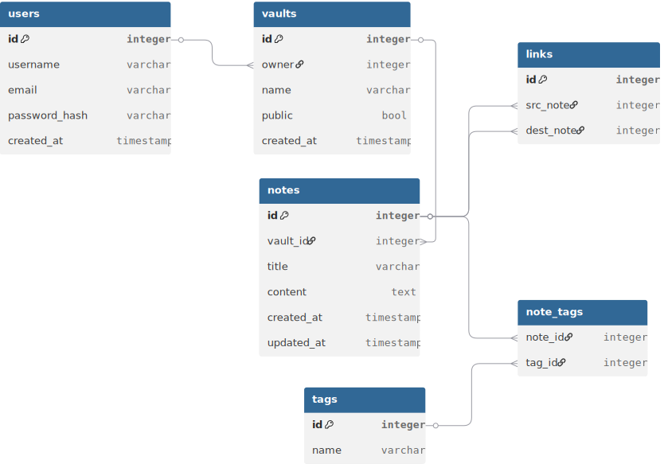

# leaflink-online

[English](README.md) | 繁體中文

## 專案介紹
114年第二學期網頁資料庫程式設計課程期末專題。

啟發於 Obsidian，將 Obsidian 的功能實作成簡單的網頁版。

## 技術棧
### 前端
框架：SvelteKit\
使用 Single-page app，搭配 HTML 和 CSS，運行在 Nginx 上

### 後端
使用 FastAPI，透過 Docker 運行

### 資料庫
使用 PostgreSQL

### 其他
提供 Dockerfile 和 Docker Compose 用於快速建立 Demo 環境。

## 開發環境
### 前端
前端使用 [fnm](https://github.com/Schniz/fnm) 管理 Node.js (SvelteKit 依賴 Node.js)\
套件管理工具使用 `pnpm` \
進入前端開發需要進入 `frontend` 目錄
開發時使用以下指令：
|       指令        | 說明                                        |
| :---------------: | :------------------------------------------ |
| `pnpm dev --open` | 運行 dev Server 監聽開發變化，`Ctrl+C` 關閉 |
> 備註： `--open` 會自動打開分頁，如果不希望自動打開分頁請把該參數刪除

### 後端
|   環境   | 說明                                                      |
| :------: | :-------------------------------------------------------- |
|  Python  | 3.12+                                                     |
| 依賴管理 | Astral uv                                                 |
| 開發運行 | `uvicorn main:app --reload`                               |
| 生產運行 | `gunicorn -w 4 -k uvicorn.workers.UvicornWorker main:app` |

啟動後端後，可在以下位置查看互動式 API 文件：

|     工具     | URL                                |
| :----------: | :--------------------------------- |
|  Swagger UI  | http://localhost:8000/docs         |
|    ReDoc     | http://localhost:8000/redoc        |
| OpenAPI JSON | http://localhost:8000/openapi.json |

### 專案目錄架構
```
leaflink-online
├── frontend/
├── backend/  
├── db/
└── README.md
```

## MVP
### 預定目標
- 使用者功能
  - [x] 註冊功能
  - [x] 登入 + JWT
- [x] Vault 隱私權設定
- [x] Markdown 筆記 CRUD 與瀏覽
- [x] Markdown 筆記 / Vault 上傳
- [ ] `[[雙向連結]]`解析與 Backlinks 顯示
- [x] 標籤系統與全文搜尋（PostgreSQL tsvector）

### 額外目標
- [x] 個人線上編輯 Markdown 筆記和 Vault
- [ ] 知識網路(D3.js)

## 資料庫設計


## 資料庫正規化分析

### 1NF（第一正規化）

所有資料表均滿足：
- 每個欄位儲存不可分割的原子值，無重複群組
- 各資料表均有明確定義的主鍵

**結果：全部通過 ✓**

### 2NF（第二正規化）

2NF 要求消除「部分功能相依」——非主鍵屬性必須完全依賴整個主鍵，不能只依賴複合主鍵的一部分。

唯一具有複合主鍵的資料表為 `note_tags(note_id, tag_id)`，其中無任何非主鍵屬性，故不存在部分相依。其餘資料表皆為單一欄位主鍵，2NF 自動成立。

**結果：全部通過 ✓**

### 3NF（第三正規化）

3NF 要求消除「遞移相依」——非主鍵屬性不得透過其他非主鍵屬性間接依賴主鍵。

| 資料表      | 說明                                                                               |
| :---------- | :--------------------------------------------------------------------------------- |
| `users`     | `username`、`email` 均為 UNIQUE NOT NULL，皆為候選鍵；無遞移相依 ✓                 |
| `vaults`    | 所有屬性直接依賴 `id`；無遞移相依 ✓                                                |
| `notes`     | 所有屬性直接依賴 `id`；`search_vector` 為衍生欄位（`GENERATED`），不構成相依問題 ✓ |
| `links`     | `(src_note, dest_note)` 具有 UNIQUE 約束，為候選鍵；無遞移相依 ✓                   |
| `tags`      | `name` 為 UNIQUE NOT NULL，為候選鍵；無遞移相依 ✓                                  |
| `note_tags` | 無非主鍵屬性，trivially 滿足 ✓                                                     |

**結果：全部通過 ✓**

### BCNF（Boyce-Codd 正規化）

BCNF 是比 3NF 更嚴格的標準，要求每個「決定因子」（Determinant）都必須是候選鍵。

| 資料表      | 候選鍵                        | BCNF  |
| :---------- | :---------------------------- | :---: |
| `users`     | `id`、`username`、`email`     |   ✓   |
| `vaults`    | `id`                          |   ✓   |
| `notes`     | `id`                          |   ✓   |
| `links`     | `id`、`(src_note, dest_note)` |   ✓   |
| `tags`      | `id`、`name`                  |   ✓   |
| `note_tags` | `(note_id, tag_id)`           |   ✓   |

所有資料表中，每個決定因子均為候選鍵，無 BCNF 違規。

**結果：全部通過 ✓**

## 分工
- [Just-Passersby](https://github.com/Just-Passersby): Database + API + Docker 部署 + 專題規劃
- [Lcd0327](https://github.com/Lcd0327): 前端開發 + API整合

## 額外說明
- Markdown 純文字存在DB內
- 先不做圖片上傳，純 markdown 檔，降低複雜度

## 許可證
leaflink-online 使用 [Apache 2.0 許可證](LICENSE)
